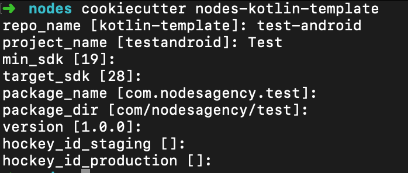

# kotlin-template-starter
Kotlin Clean Architecture Template Project. Uses dagger2 for dependency injection y'all

You can change some common stuff



### Install
```
1. Install python
2. Install pip
3. pip install cookiecutter
```

Scaffold your project:
```
cookiecutter https://github.com/dtunctuncer/kotlin-template-starter.git
```
### Project Tree After Scaffold
```bash
├── app
│   ├── app.iml
│   ├── build.gradle
│   ├── proguard-rules.pro
│   └── src
│       ├── androidTest
│       │   └── java
│       │       └── com
│       │           └── nodesagency
│       │               └── test
│       │                   └── ExampleInstrumentedTest.kt
│       ├── debug
│       │   ├── AndroidManifest.xml
│       │   └── res
│       │       └── xml
│       │           └── network_security_config.xml
│       ├── main
│       │   ├── AndroidManifest.xml
│       │   ├── assets
│       │   │   └── all_translations.json
│       │   ├── java
│       │   │   └── com
│       │   │       └── nodesagency
│       │   │           └── test
│       │   │               ├── App.kt
│       │   │               ├── inititializers
│       │   │               │   └── AppInitializer.kt
│       │   │               ├── injection
│       │   │               │   ├── components
│       │   │               │   │   └── AppComponent.kt
│       │   │               │   └── modules
│       │   │               │       ├── AppModule.kt
│       │   │               │       ├── ExecutorModule.kt
│       │   │               │       ├── InteractorModule.kt
│       │   │               │       ├── RestModule.kt
│       │   │               │       ├── RestRepositoryBinding.kt
│       │   │               │       └── StorageBindingModule.kt
│       │   │               └── storage
│       │   │                   ├── PrefManagerImpl.kt
│       │   │                   └── base
│       │   │                       └── GsonFileStorageRepository.kt
│       │   └── res
│       │       ├── menu
│       │       │   └── main.xml
│       │       ├── mipmap-hdpi
│       │       │   ├── ic_launcher.png
│       │       │   └── ic_launcher_round.png
│       │       ├── mipmap-mdpi
│       │       │   ├── ic_launcher.png
│       │       │   └── ic_launcher_round.png
│       │       ├── mipmap-xhdpi
│       │       │   ├── ic_launcher.png
│       │       │   └── ic_launcher_round.png
│       │       ├── mipmap-xxhdpi
│       │       │   ├── ic_launcher.png
│       │       │   └── ic_launcher_round.png
│       │       ├── mipmap-xxxhdpi
│       │       │   ├── ic_launcher.png
│       │       │   └── ic_launcher_round.png
│       │       └── values
│       │           ├── attrs.xml
│       │           ├── colors.xml
│       │           ├── dimens.xml
│       │           ├── ids.xml
│       │           ├── nstack_keys.xml
│       │           ├── strings.xml
│       │           └── styles.xml
│       └── test
│           └── java
│               └── com
│                   └── nodesagency
│                       └── test
│                           └── ExampleUnitTest.kt
├── build.gradle
├── data
│   ├── build.gradle
│   ├── data.iml
│   └── src
│       └── main
│           └── java
│               └── com
│                   └── nodesagency
│                       └── test
│                           ├── models
│                           │   ├── Photo.kt
│                           │   └── Post.kt
│                           ├── network
│                           │   ├── Api.kt
│                           │   ├── RestPostRepository.kt
│                           │   └── util
│                           │       ├── BufferedSourceConverterFactory.kt
│                           │       ├── DateDeserializer.kt
│                           │       ├── ItemTypeAdapterFactory.kt
│                           │       └── RetrofitExtensions.kt
│                           └── repositories
│                               ├── PostRepository.kt
│                               └── RepositoryException.kt
├── domain
│   ├── build.gradle
│   ├── domain.iml
│   └── src
│       └── main
│           └── java
│               └── com
│                   └── nodesagency
│                       └── test
│                           └── domain
│                               ├── extensions
│                               │   └── Extensions.kt
│                               ├── interactors
│                               │   ├── BaseAsyncInteractor.kt
│                               │   ├── InteractorResult.kt
│                               │   └── PostsInteractor.kt
│                               └── managers
│                                   └── PrefManager.kt
├── gradle
│   └── wrapper
│       ├── gradle-wrapper.jar
│       └── gradle-wrapper.properties
├── gradle.properties
├── gradlew
├── gradlew.bat
├── local.properties
├── presentation
│   ├── build.gradle
│   ├── presentation.iml
│   ├── proguard-rules.pro
│   └── src
│       ├── androidTest
│       │   └── java
│       │       └── com
│       │           └── nodesagency
│       │               └── test
│       │                   └── presentation
│       │                       └── ExampleInstrumentedTest.java
│       ├── main
│       │   ├── AndroidManifest.xml
│       │   ├── assets
│       │   │   └── all_translations.json
│       │   ├── java
│       │   │   └── com
│       │   │       └── nodesagency
│       │   │           └── test
│       │   │               └── presentation
│       │   │                   ├── extensions
│       │   │                   │   ├── ContextExtensions.kt
│       │   │                   │   ├── InteractorExtensions.kt
│       │   │                   │   ├── LifecycleOwnerExtensions.kt
│       │   │                   │   └── LiveDataExtensions.kt
│       │   │                   ├── injection
│       │   │                   │   ├── DaggerViewModelFactory.kt
│       │   │                   │   ├── ViewModelBuilder.kt
│       │   │                   │   └── ViewModelKey.kt
│       │   │                   ├── nstack
│       │   │                   │   └── Translation.java
│       │   │                   ├── ui
│       │   │                   │   ├── base
│       │   │                   │   │   ├── BaseActivity.kt
│       │   │                   │   │   ├── BaseFragment.kt
│       │   │                   │   │   ├── BaseViewModel.kt
│       │   │                   │   │   └── BaseViewModelExtensions.kt
│       │   │                   │   └── main
│       │   │                   │       ├── MainActivity+Hockey.kt
│       │   │                   │       ├── MainActivity+NStack.kt
│       │   │                   │       ├── MainActivity.kt
│       │   │                   │       ├── MainActivityBuilder.kt
│       │   │                   │       ├── MainActivityViewModel.kt
│       │   │                   │       └── MainActivityViewState.kt
│       │   │                   └── util
│       │   │                       ├── SharedElementHelper.kt
│       │   │                       └── SingleEvent.kt
│       │   └── res
│       │       ├── layout
│       │       │   └── activity_main.xml
│       │       └── values
│       │           ├── nstack_keys.xml
│       │           └── strings.xml
│       └── test
│           └── java
│               └── com
│                   └── nodesagency
│                       └── test
│                           └── presentation
│                               └── ExampleUnitTest.java
└── settings.gradle

90 directories, 96 files
```


## Nodes Architecture Library
The Template uses components from our Architecture library so be sure to read up on how that is used as well

https://github.com/nodes-android/nodes-architecture-android


__Below information might be slightly out of date__
### Layers
This is a 4 layer onion architecture. Dependencies are only allowed to point inwards, 
meaning that the inner layer most not reference code in the outer layers directly. 
From inside out it consists of:

#### Entities
Models/POJOs implemented as data objects in kotlin.

#### Business Logic / Use Cases
Consist of interactors and repositories (the interfaces). The interactors encapsulates the business logic
 and perform operations on the entities. Interactors are scheduled to run in the
 background and return information to the outer layer through callbacks implemented in the outer layers.
 
#### Interface Adapters
ViewModel (as part of the MVVM pattern) are implemented in this layer. ViewModel holds information
from the inner layers (business logic and entities) to the user interface etc. In other words they adapt
the data for output to the outermost layer (Framework and Drivers)

#### Frameworks and Drivers
This is the outmost layer consisting of things such as the User interface (for android Activities, fragments etc), database libraries, retrofit,
okhttp etc. This also contain specific implementations of the Repository interfaces the business logic layer needs to access data.

## Flow of control
Example: 
1. User clicks a button that loads a list of posts in a view.
3. OnClickListener executes a Interactor/UseCase asynchronously in the business logic layer.
4. The Interactor runs in the background accessing a post repository which fetches a list of posts
5. Presenter gets notified with the loaded posts or a message in case of error trough a callback
6. Presenter instructs the view (if attached) to update itself with the new data, or display an error to the user

## Patterns in use:
- MVVM
- Repository
- Interactor (implemented with a pluggable executor)
- Dependency Injection (and thus factory)
- Inward dependency rule (all dependencies must point inwards)

## Stuff
- kotlin data classes as entities
- Retrofit2/OkHttp3
- Android kotlin extensions (views are automatically made into properties on the activity)
- Uses nstack-kotlin
- Mockito and junit for testing

## Inspired/partially ripped off from the following sources:
- [Clean Architecture by Uncle Bob](http://blog.8thlight.com/uncle-bob/2012/08/13/the-clean-architecture.html)
- [Some dudes android implementation](https://medium.com/@dmilicic/a-detailed-guide-on-developing-android-apps-using-the-clean-architecture-pattern-d38d71e94029)
- [Some other dudes implementation](https://fernandocejas.com/2014/09/03/architecting-android-the-clean-way)
